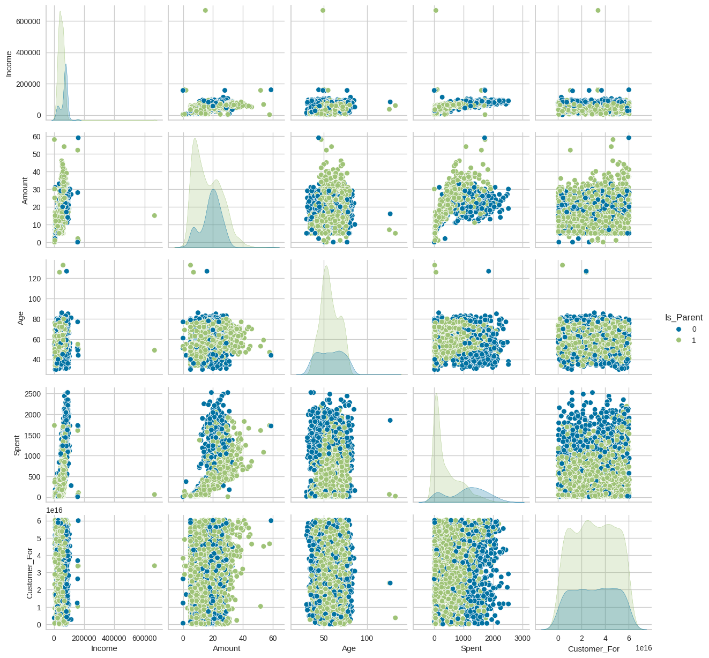
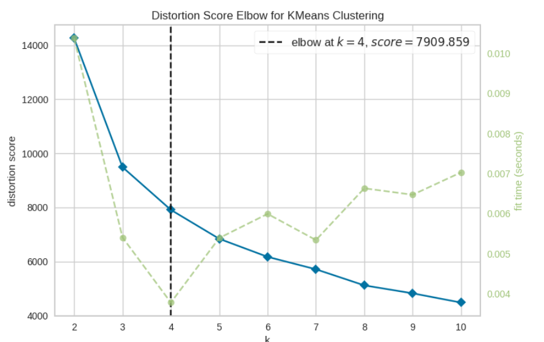
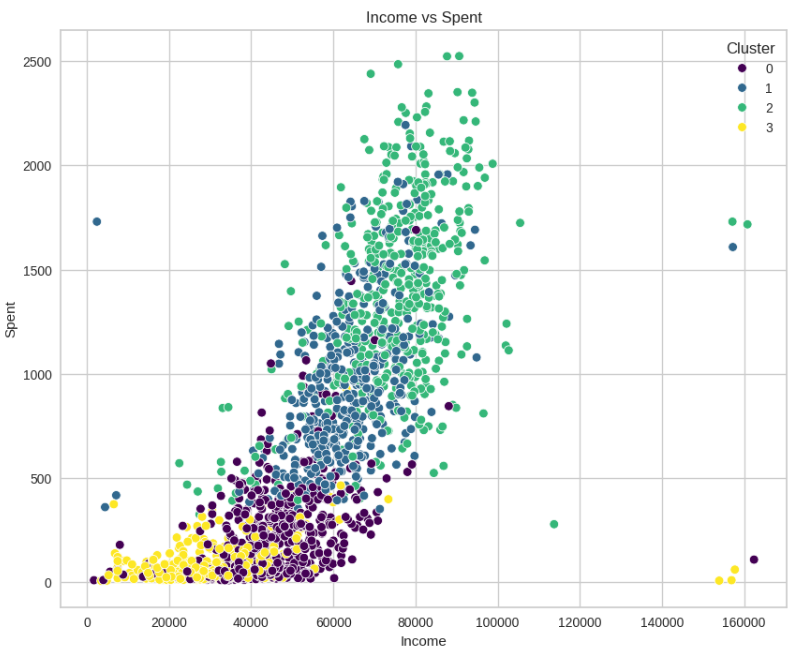
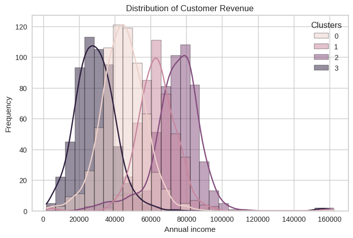
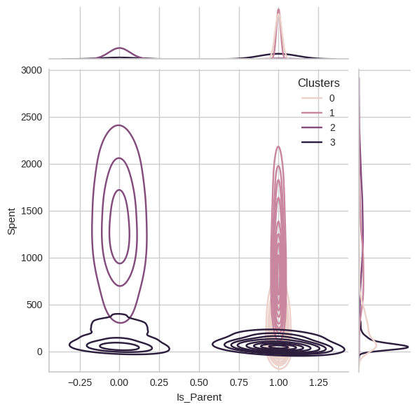
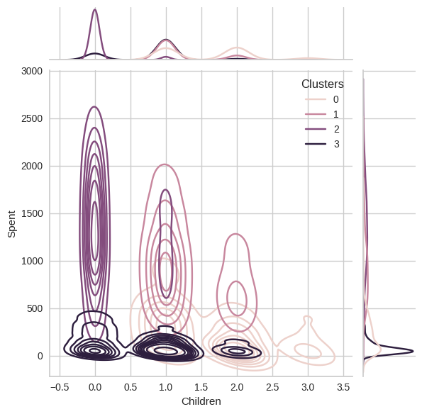

# Customer Segmentation Analysis

Unsupervised clustering of marketing campaign data to segment customers by spending behavior and demographics.

**Dataset:** [Marketing Campaign](https://www.kaggle.com/datasets/rodsaldanha/arketing-campaign) (Kaggle)
**Stack:** Python - pandas, numpy, scikit-learn, scipy, seaborn, matplotlib, yellowbrick

## Methodology

- **Cleaning:** dropped nulls, removed age/income outliers (age > 90, income > 600k)
- **Feature engineering:** derived `Age`, `Spent` (total across product categories), `Amount` (total purchases across channels), `Customer_For` (tenure in days), `Children`, `Is_Parent`; simplified `Education` and `Marital_Status` into fewer categories
- **Encoding/scaling:** label-encoded categoricals, standardized all features (`StandardScaler`)
- **Dimensionality reduction:** PCA to 3 components
- **Cluster selection:** Elbow method (`KElbowVisualizer`) to choose k
- **Clustering:** Agglomerative (ward linkage), k=4

## EDA

Pairwise relationships between income, spend, age, and parental status:



## Results

Four customer segments emerged, separated mainly by income and spend, with family status as a secondary driver:

| Cluster | Income | Spend | Profile |
|---|---|---|---|
| 2 | High | Highest | Affluent, mostly no children - premium segment |
| 1 | Mid-high | Moderate-high | Mostly 1 child - established family spenders |
| 0 | Low-mid | Low-moderate | 1-3 children - budget-conscious families |
| 3 | Lowest | Near-zero | Low spend regardless of income - low-engagement/price-sensitive |

 

 



*(to expand: business recommendations per segment - e.g. targeted offers, retention focus)*

-

## Repo Structure

```
├── README.md
├── customer_segmentation.ipynb
├── requirements.txt
└── images/
```

## Run It

```bash
pip install -r requirements.txt
jupyter notebook customer_segmentation.ipynb
```
